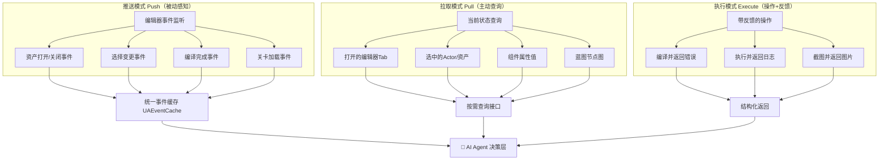

# UnrealAgent 扩展功能规划文档

> **版本**: v1.0  
> **日期**: 2026-03-06  
> **状态**: 规划阶段  

---

## 一、设计哲学

### 第一性原理

UE Agent 的本质是：**代替人类操作 Unreal Editor，完成游戏开发中的创作、调试、查询任务。**

一个人类开发者在 UE 中工作时依赖三层感知：

```
┌─────────────────────────────────────────────────────────┐
│                    人类开发者的感知层                       │
├─────────────────────────────────────────────────────────┤
│  👁️ 视觉感知                                             │
│    ├── 当前打开了什么窗口/Tab                               │
│    ├── 视口中看到了什么场景                                  │
│    ├── 选中了什么对象                                       │
│    ├── 属性面板显示的详情                                    │
│    └── 日志/消息面板的输出                                   │
│                                                          │
│  🧠 上下文记忆                                             │
│    ├── 项目结构和约定                                       │
│    ├── 资产之间的依赖关系                                    │
│    ├── 上一步做了什么操作                                    │
│    └── 当前任务的目标是什么                                   │
│                                                          │
│  🖱️ 交互反馈                                               │
│    ├── 操作后的视觉反馈（编译成功/失败）                       │
│    ├── 错误提示和警告                                       │
│    └── 性能表现（帧率、内存等）                               │
└─────────────────────────────────────────────────────────┘
```

扩展目标：将 Agent 从 "材质专精 + 基础场景操作" 升级为 **全面的 UE 编辑器 AI 协作平台**。

---

## 二、现状分析

### 当前能力矩阵

| 人类感知维度 | 当前 Agent 能力 | 覆盖度 | 关键差距 |
|---|---|---|---|
| **视口场景** | `get_viewport_camera`, `move_viewport_camera`, `focus_on_actor` | ⭐⭐⭐ | ❌ 无法"看到"场景（截图/渲染） |
| **选中对象** | `get_editor_state`, `select_actors` | ⭐⭐⭐⭐ | ✅ 基本覆盖 |
| **对象详情** | `get_actor_details`, `get_asset_info` | ⭐⭐⭐ | ❌ 缺少组件属性深层读写 |
| **场景结构** | `get_world_outliner`, `get_current_level` | ⭐⭐⭐⭐ | ✅ 基本覆盖 |
| **资产管理** | `list_assets`, `search_assets`, `get_asset_references` | ⭐⭐⭐⭐ | ❌ 缺少资产创建/复制/重命名 |
| **材质编辑** | 完整的材质节点图操作 | ⭐⭐⭐⭐⭐ | ✅ 非常完善 |
| **蓝图编辑** | 无 | ⭐ | ❌ **最大缺口** |
| **编辑器状态** | `get_project_info`, `get_editor_state` | ⭐⭐⭐ | ❌ 缺少当前打开窗口/Tab |
| **操作反馈** | `undo`, `redo`, `recompile_material` | ⭐⭐⭐ | ❌ 缺少编译日志/错误捕获 |
| **万能后备** | `execute_python` | ⭐⭐⭐⭐ | ✅ 理论上可补齐大部分缺口 |

### 现有模块清单（10个）

| 模块 | 文件 | 职责 |
|---|---|---|
| `UACommandBase` | CommandBase.h/cpp | 命令基类 |
| `UACommandRegistry` | CommandRegistry.h/cpp | 命令注册中心 |
| `UAActorCommands` | ActorCommands.h/cpp | Actor CRUD + 选择 |
| `UAAssetCommands` | AssetCommands.h/cpp | 资产查询/搜索/引用 |
| `UAEditorCommands` | EditorCommands.h/cpp | 编辑器状态/Undo/Redo |
| `UAMaterialCommands` | MaterialCommands.h/cpp | 材质图完整操作 |
| `UAProjectCommands` | ProjectCommands.h/cpp | 项目信息 |
| `UAPythonCommands` | PythonCommands.h/cpp | Python 执行环境 |
| `UAViewportCommands` | ViewportCommands.h/cpp | 视口相机控制 |
| `UAWorldCommands` | WorldCommands.h/cpp | 世界/关卡/Actor详情 |

---

## 三、扩展方案总览

### 新增 6 个命令模块 + 2 个基础设施

```mermaid
graph TB
    subgraph "Phase 1: 感知层"
        C1[UAContextCommands<br/>5个方法]
        C2[UAPropertyCommands<br/>3个方法]
    end
    
    subgraph "Phase 2: 操作层"
        C3[UABlueprintCommands<br/>11个方法]
        C4[UAAssetManageCommands<br/>6个方法]
    end
    
    subgraph "Phase 3: 闭环层"
        C5[UAScreenshotCommands<br/>2个方法]
        C6[UAEventCommands<br/>2个方法]
    end
    
    subgraph "现有模块（8个）"
        E1[UAProjectCommands]
        E2[UAAssetCommands]
        E3[UAWorldCommands]
        E4[UAActorCommands]
        E5[UAViewportCommands]
        E6[UAPythonCommands]
        E7[UAEditorCommands]
        E8[UAMaterialCommands]
    end
    
    subgraph "基础设施（新增）"
        R[UACommandRegistry]
        L[UALogCapture<br/>日志截获]
        EC[UAEventCache<br/>事件缓存]
    end
    
    C1 & C2 & C3 & C4 & C5 & C6 --> R
    E1 & E2 & E3 & E4 & E5 & E6 & E7 & E8 --> R
    C1 -.-> L
    C6 -.-> EC
    
    style C1 fill:#ff6b6b,color:#fff
    style C2 fill:#ff6b6b,color:#fff
    style C3 fill:#ffa502,color:#fff
    style C4 fill:#ffa502,color:#fff
    style C5 fill:#2ed573,color:#fff
    style C6 fill:#2ed573,color:#fff
```



### 信息获取架构策略：Push + Pull 混合模式



| 策略 | 适用场景 | 实现方式 |
|---|---|---|
| **Push（事件推送）** | 状态频繁变化的信息（选择、编译结果） | 注册 UE Delegate，缓存到环形队列，Agent 查询 |
| **Pull（按需查询）** | 状态相对稳定的信息（蓝图结构、资产列表） | Agent 发起 JSON-RPC 请求时实时查询 |

---

## 四、Phase 1：核心感知层 — "让 Agent 看得见"

### 模块 1: UAContextCommands — 编辑器上下文感知

**核心目标：** 让 Agent 知道 "用户正在干什么"，解决 "这个" 的指代消歧问题。

#### 方法 1.1: `get_open_editors` — 获取当前打开的资产编辑器

| 属性 | 值 |
|---|---|
| 输入参数 | 无 |
| 返回值 | `{ editors: [{ asset_path, asset_name, asset_class, editor_name }], count }` |
| UE API | `UAssetEditorSubsystem::GetAllEditedAssets()` + `FindEditorForAsset()` |
| 必须原生命令 | Python 绑定未暴露 `UAssetEditorSubsystem`，必须 C++ 调用 |

**AI 使用场景：**
```
用户: "帮我改一下这个材质"
Agent: → get_open_editors → 发现 /Game/Materials/M_Rock 已打开
       → 自动理解 "这个" = M_Rock
```

**核心实现：**
```cpp
bool ExecuteGetOpenEditors(TSharedPtr<FJsonObject>& OutResult, FString& OutError)
{
    UAssetEditorSubsystem* Subsystem = GEditor->GetEditorSubsystem<UAssetEditorSubsystem>();
    TArray<UObject*> EditedAssets = Subsystem->GetAllEditedAssets();
    
    TArray<TSharedPtr<FJsonValue>> EditorList;
    for (UObject* Asset : EditedAssets)
    {
        TSharedPtr<FJsonObject> EditorObj = MakeShared<FJsonObject>();
        EditorObj->SetStringField("asset_path", Asset->GetPathName());
        EditorObj->SetStringField("asset_name", Asset->GetName());
        EditorObj->SetStringField("asset_class", Asset->GetClass()->GetName());
        
        IAssetEditorInstance* EditorInstance = Subsystem->FindEditorForAsset(Asset, false);
        if (EditorInstance)
        {
            EditorObj->SetStringField("editor_name", EditorInstance->GetEditorName().ToString());
        }
        EditorList.Add(MakeShared<FJsonValueObject>(EditorObj));
    }
    
    OutResult = MakeShared<FJsonObject>();
    OutResult->SetArrayField("editors", EditorList);
    OutResult->SetNumberField("count", EditorList.Num());
    return true;
}
```

#### 方法 1.2: `get_selected_assets` — Content Browser 选中项

| 属性 | 值 |
|---|---|
| 输入参数 | 无 |
| 返回值 | `{ assets: [{ path, name, class }], count }` |
| UE API | `UEditorUtilityLibrary::GetSelectedAssetData()` |

#### 方法 1.3: `get_browser_path` — Content Browser 当前路径

| 属性 | 值 |
|---|---|
| 输入参数 | 无 |
| 返回值 | `{ current_path: "/Game/Materials", paths: [...] }` |
| UE API | `FContentBrowserModule::Get().GetSelectedPathViewFolders()` |

#### 方法 1.4: `get_message_log` — 消息日志（编译错误等）

| 属性 | 值 |
|---|---|
| 输入参数 | `{ category?: "BlueprintLog" \| "MaterialEditor" \| "PIE", count?: 20 }` |
| 返回值 | `{ messages: [{ severity, text, category, timestamp }], count }` |
| UE API | `FMessageLog` + 自定义 `UALogCapture` 缓存系统 |
| 基础设施依赖 | 需要 `UALogCapture`（插件启动时注册 `FOutputDevice`） |

**AI 使用场景：**
```
Agent: → recompile_material → get_message_log(category="MaterialEditor")
       → 发现 "Error: Missing texture parameter"
       → 自动定位并修复
```

#### 方法 1.5: `get_output_log` — 输出日志最近 N 条

| 属性 | 值 |
|---|---|
| 输入参数 | `{ count?: 50, filter?: "Warning" }` |
| 返回值 | `{ lines: [{ text, verbosity, category }], count }` |
| 复用 | 与 `get_message_log` 共享 `UALogCapture` 底层 |

---

### 基础设施: UALogCapture — 日志截获系统

在插件 `StartupModule` 时注册，截获 UE 的输出日志。

```cpp
class UALogCapture : public FOutputDevice
{
    TArray<FUALogEntry> RecentLogs;  // 环形缓冲区，保留最近 500 条
    FCriticalSection Lock;
    int32 MaxBufferSize = 500;
    
    virtual void Serialize(const TCHAR* V, ELogVerbosity::Type Verbosity, 
        const FName& Category) override
    {
        FScopeLock ScopeLock(&Lock);
        FUALogEntry Entry;
        Entry.Text = V;
        Entry.Severity = Verbosity;
        Entry.Category = Category.ToString();
        Entry.Timestamp = FDateTime::Now();
        
        if (RecentLogs.Num() >= MaxBufferSize)
        {
            RecentLogs.RemoveAt(0); // 环形移除最旧
        }
        RecentLogs.Add(MoveTemp(Entry));
    }
    
    TArray<FUALogEntry> GetRecent(int32 Count, const FString& CategoryFilter);
};
```

---

### 模块 2: UAPropertyCommands — 通用属性读写

**核心目标：** 基于 UE 反射系统，实现任意 UObject 属性的通用读写。

**设计原理：** UE 的一切皆对象（UObject），一切皆属性（FProperty）。通过反射系统 + 属性路径解析，Agent 可以读写任何组件的任何属性。

#### 方法 2.1: `get_property` — 读取任意属性

| 属性 | 值 |
|---|---|
| 输入参数 | `{ actor_name: "PointLight1", property_path: "LightComponent.Intensity" }` |
| 返回值 | `{ value: 5000.0, type: "float", property_name: "Intensity" }` |
| UE API | `FProperty::ExportText_Direct()` + 反射系统 |

**属性路径格式：**
```
"ComponentName.PropertyName"          → "PointLightComponent.Intensity"
"ComponentName.StructProp.Field"      → "RootComponent.RelativeLocation.X"
"ComponentName.ObjectRef"             → "StaticMeshComponent.StaticMesh"
```

**核心实现：**
```cpp
bool ExecuteGetProperty(const TSharedPtr<FJsonObject>& Params, ...)
{
    FString ActorName = Params->GetStringField("actor_name");
    FString PropertyPath = Params->GetStringField("property_path");
    
    // Step 1: 找到 Actor
    AActor* Actor = FindActorByName(ActorName);
    
    // Step 2: 按 "." 分割路径
    TArray<FString> PathSegments;
    PropertyPath.ParseIntoArray(PathSegments, TEXT("."));
    
    // Step 3: 第一段 = 组件名，定位组件
    UActorComponent* Component = FindComponentByName(Actor, PathSegments[0]);
    
    // Step 4: 后续段 = 属性链，沿反射系统逐层解析
    UObject* CurrentObj = Component;
    void* CurrentContainer = CurrentObj;
    FProperty* CurrentProp = nullptr;
    
    for (int32 i = 1; i < PathSegments.Num(); ++i)
    {
        CurrentProp = FindFProperty<FProperty>(CurrentObj->GetClass(), *PathSegments[i]);
        if (FStructProperty* StructProp = CastField<FStructProperty>(CurrentProp))
        {
            CurrentContainer = StructProp->ContainerPtrToValuePtr<void>(CurrentContainer);
        }
    }
    
    // Step 5: 序列化为 JSON
    OutResult->SetField("value", PropertyToJson(CurrentProp, ValuePtr));
    OutResult->SetStringField("type", CurrentProp->GetCPPType());
}
```

#### 方法 2.2: `set_property` — 写入任意属性

| 属性 | 值 |
|---|---|
| 输入参数 | `{ actor_name: "PointLight1", property_path: "LightComponent.Intensity", value: 8000 }` |
| 返回值 | `{ success: true, old_value: 5000, new_value: 8000 }` |
| 设计要点 | **必须包裹在 `FScopedTransaction` 中**，支持 Undo |

**核心实现要点：**
```cpp
bool ExecuteSetProperty(...)
{
    FScopedTransaction Transaction(LOCTEXT("SetProperty", "Agent: Set Property"));
    
    // 解析路径找到目标属性...
    CurrentObj->Modify();  // 标记为已修改
    
    // 反序列化 JSON → 属性值
    JsonToProperty(Property, ValuePtr, Params->GetField("value"), OutError);
    
    // 通知属性变更（触发编辑器 UI 刷新）
    FPropertyChangedEvent Event(Property);
    CurrentObj->PostEditChangeProperty(Event);
}
```

**AI 使用场景：**
```
用户: "把场景里所有灯光亮度调暗一半"
Agent: → get_world_outliner(class_filter="Light")
       → 对每个: get_property(actor, "LightComponent.Intensity")
       → 计算 value / 2
       → set_property(actor, "LightComponent.Intensity", newValue)
```

#### 方法 2.3: `list_properties` — 列出所有可编辑属性

| 属性 | 值 |
|---|---|
| 输入参数 | `{ actor_name: "PointLight1", component_name?: "LightComponent" }` |
| 返回值 | `{ properties: [{ name, type, category, value_preview, is_editable }], count }` |
| 设计要点 | 只列出 `CPF_Edit` 标记的属性，跳过内部属性 |

```cpp
for (TFieldIterator<FProperty> PropIt(TargetClass); PropIt; ++PropIt)
{
    FProperty* Prop = *PropIt;
    if (!Prop->HasAnyPropertyFlags(CPF_Edit)) continue; // 只列可编辑属性
    
    PropObj->SetStringField("name", Prop->GetName());
    PropObj->SetStringField("type", Prop->GetCPPType());
    PropObj->SetStringField("category", Prop->GetMetaData("Category"));
    
    FString ValueStr;
    Prop->ExportText_Direct(ValueStr, 
        Prop->ContainerPtrToValuePtr<void>(TargetObj), nullptr, nullptr, 0);
    PropObj->SetStringField("value_preview", ValueStr.Left(100));
}
```

---

## 五、Phase 2：核心操作层 — "让 Agent 做得了"

### 模块 3: UABlueprintCommands — 蓝图读写

**核心目标：** 蓝图是 UE 游戏逻辑的核心载体。一个不能读写蓝图的 Agent，有致命缺陷。

**设计模式：** 镜像材质图（`UAMaterialCommands`）的设计 — 查询图结构 + 操作节点 + 编译。

#### 方法 3.1: `get_blueprint_overview` — 蓝图概览

| 属性 | 值 |
|---|---|
| 输入参数 | `{ asset_path: "/Game/Blueprints/BP_Player" }` |
| 返回值 | 见下 |

```json
{
  "name": "BP_Player",
  "parent_class": "Character",
  "graphs": [
    { "name": "EventGraph", "type": "event_graph", "node_count": 15 },
    { "name": "UpdateHUD", "type": "function", "node_count": 8 }
  ],
  "variables": [
    { "name": "Health", "type": "float", "default_value": "100.0", "is_exposed": true },
    { "name": "CurrentWeapon", "type": "AWeapon*", "is_exposed": false }
  ],
  "event_dispatchers": [
    { "name": "OnDamaged", "params": [{ "name": "Damage", "type": "float" }] }
  ],
  "interfaces": ["BPI_Interactable"],
  "is_compiled": true,
  "compile_status": "UpToDate"
}
```

#### 方法 3.2: `get_blueprint_graph` — 节点图详情

| 属性 | 值 |
|---|---|
| 输入参数 | `{ asset_path, graph_name?: "EventGraph" }` |
| 返回值 | 节点列表 + 连接关系（镜像 `get_material_graph` 的设计） |

```json
{
  "graph_name": "EventGraph",
  "nodes": [
    {
      "index": 0,
      "class": "K2Node_Event",
      "title": "Event BeginPlay",
      "node_pos_x": -320, "node_pos_y": 0,
      "pins": [
        { "name": "then", "direction": "output", "type": "exec",
          "connected_to": [{ "node_index": 1, "pin_name": "execute" }] }
      ]
    },
    {
      "index": 1,
      "class": "K2Node_CallFunction",
      "title": "Print String",
      "function_name": "PrintString",
      "target_class": "KismetSystemLibrary",
      "pins": [
        { "name": "execute", "direction": "input", "type": "exec" },
        { "name": "InString", "direction": "input", "type": "string", "default_value": "Hello" },
        { "name": "then", "direction": "output", "type": "exec" }
      ]
    }
  ],
  "connections": [
    { "from_node": 0, "from_pin": "then", "to_node": 1, "to_pin": "execute" }
  ]
}
```

**核心实现要点：**
```cpp
// 两遍扫描：先建立索引映射，再序列化
// Pass 1: NodeIndexMap[Node] = Index
// Pass 2: 序列化每个节点，引脚的连接用索引引用

// 关键 UE API:
// UBlueprint::GetAllGraphs()  → 获取所有图
// UEdGraph::Nodes             → 节点列表
// UEdGraphNode::Pins          → 引脚列表
// UEdGraphPin::LinkedTo       → 连接关系
// UK2Node_CallFunction::FunctionReference → 函数引用信息
```

#### 方法 3.3: `get_blueprint_variables` — 变量定义列表

| 属性 | 值 |
|---|---|
| 输入参数 | `{ asset_path }` |
| 返回值 | `{ variables: [{ name, type, default_value, category, is_exposed, is_replicated }] }` |

#### 方法 3.4: `get_blueprint_functions` — 函数签名列表

| 属性 | 值 |
|---|---|
| 输入参数 | `{ asset_path }` |
| 返回值 | `{ functions: [{ name, inputs: [...], outputs: [...], is_pure, access_specifier }] }` |

#### 方法 3.5: `add_node` — 添加蓝图节点

| 属性 | 值 |
|---|---|
| 输入参数 | `{ asset_path, graph_name?, node_class, function_name?, variable_name?, node_pos_x?, node_pos_y? }` |
| 返回值 | `{ success, node_index, node_title, pins: [...] }` |

**支持的 node_class 类型：**

| node_class | 创建方式 | 额外参数 |
|---|---|---|
| `CallFunction` | 函数调用节点 | `function_name`, `target_class` |
| `Event` | 事件节点 | `event_name` |
| `IfThenElse` | 分支节点 | 无 |
| `MacroInstance` | 宏实例 | `macro_path` |
| `VariableGet` | 变量获取 | `variable_name` |
| `VariableSet` | 变量设置 | `variable_name` |
| `CustomEvent` | 自定义事件 | `event_name` |

**核心实现要点：**
```cpp
FScopedTransaction Transaction(LOCTEXT("AddBPNode", "Agent: Add Blueprint Node"));

// 根据 node_class 创建对应节点
// Graph->AddNode(NewNode, true, false);
// NewNode->AllocateDefaultPins();
// FBlueprintEditorUtils::MarkBlueprintAsModified(BP);
```

#### 方法 3.6: `delete_node` — 删除蓝图节点

| 属性 | 值 |
|---|---|
| 输入参数 | `{ asset_path, graph_name?, node_index }` |
| 返回值 | `{ success, deleted_node_title }` |

#### 方法 3.7: `connect_pins` — 连接蓝图引脚

| 属性 | 值 |
|---|---|
| 输入参数 | `{ asset_path, graph_name?, from_node_index, from_pin, to_node_index, to_pin }` |
| 返回值 | `{ success }` |

#### 方法 3.8: `disconnect_pin` — 断开蓝图引脚

| 属性 | 值 |
|---|---|
| 输入参数 | `{ asset_path, graph_name?, node_index, pin_name }` |
| 返回值 | `{ success, disconnected_count }` |

#### 方法 3.9: `add_variable` — 添加/修改变量

| 属性 | 值 |
|---|---|
| 输入参数 | `{ asset_path, variable_name, variable_type, default_value?, category?, is_exposed? }` |
| 返回值 | `{ success, variable_name, variable_type }` |

#### 方法 3.10: `add_function` — 添加自定义函数

| 属性 | 值 |
|---|---|
| 输入参数 | `{ asset_path, function_name, inputs?: [...], outputs?: [...], is_pure? }` |
| 返回值 | `{ success, function_name, graph_name }` |

#### 方法 3.11: `compile_blueprint` — 编译蓝图 + 返回错误

| 属性 | 值 |
|---|---|
| 输入参数 | `{ asset_path }` |
| 返回值 | `{ success, status: "UpToDate"/"Error"/"Warning", errors: [...], warnings: [...] }` |
| UE API | `FKismetEditorUtilities::CompileBlueprint()` |

**AI 闭环使用场景：**
```
Agent: → add_node → connect_pins → compile_blueprint
       → 发现编译错误 → 分析错误信息 → 修正连接 → 再编译
```

---

### 模块 4: UAAssetManageCommands — 资产管理操作

**核心目标：** 补全资产的"增删改"操作，当前只有"查"。

#### 方法 4.1: `create_asset` — 创建新资产

| 属性 | 值 |
|---|---|
| 输入参数 | `{ asset_name, package_path, asset_class, factory_params? }` |
| 返回值 | `{ success, asset_path, asset_class }` |
| UE API | `IAssetTools::CreateAsset()` |

**支持的 asset_class → Factory 自动映射：**

| asset_class | Factory | 额外参数 |
|---|---|---|
| `Material` | `UMaterialFactoryNew` | 无 |
| `MaterialInstance` | `UMaterialInstanceConstantFactoryNew` | `parent_material` |
| `Blueprint` | `UBlueprintFactory` | `parent_class` |
| `DataTable` | `UDataTableFactory` | `row_struct` |
| `CurveFloat` | `UCurveFloatFactory` | 无 |

#### 方法 4.2: `duplicate_asset` — 复制资产

| 属性 | 值 |
|---|---|
| 输入参数 | `{ source_path, dest_path, new_name }` |
| 返回值 | `{ success, new_asset_path }` |

#### 方法 4.3: `rename_asset` — 重命名/移动资产

| 属性 | 值 |
|---|---|
| 输入参数 | `{ asset_path, new_name?, new_path? }` |
| 返回值 | `{ success, old_path, new_path }` |

#### 方法 4.4: `delete_asset` — 删除资产

| 属性 | 值 |
|---|---|
| 输入参数 | `{ asset_path, force?: false }` |
| 返回值 | `{ success, had_references: bool }` |
| 设计要点 | 默认安全模式：如有引用则拒绝删除，`force=true` 强制删除 |

#### 方法 4.5: `save_asset` — 保存资产

| 属性 | 值 |
|---|---|
| 输入参数 | `{ asset_path }` 或 `{ save_all: true }` |
| 返回值 | `{ success, saved_assets: [...] }` |
| UE API | `UEditorAssetLibrary::SaveAsset()` |

#### 方法 4.6: `create_folder` — 创建文件夹

| 属性 | 值 |
|---|---|
| 输入参数 | `{ folder_path: "/Game/Materials/NewFolder" }` |
| 返回值 | `{ success, folder_path }` |

---

## 六、Phase 3：智能闭环层 — "让 Agent 会纠错"

### 模块 5: UAScreenshotCommands — 视口截图

**核心目标：** 给 Agent 一双"眼睛"，形成"操作→观察→纠正"的闭环。

#### 截图尺寸分析

| AI 模型 | 图像处理方式 | 最大分辨率 | 实际处理 |
|---|---|---|---|
| GPT-4o | 自动切片为 512×512 tiles | 2048×2048 | 低分辨率 85 tokens，高分辨率最多 ~1105 tokens |
| Claude 3.5/4 | 自动缩放到 ≤1568px 长边 | 1568×1568 | 按像素面积计算 |
| Gemini 2.0 | 自适应缩放 | 3072×3072 | 258 tokens/图（固定） |

**结论：默认 1280×720（16:9），提供 quality 参数按需选择。**

| quality | 分辨率 | 适用场景 |
|---|---|---|
| `low` | 512×512 | 快速概览，最省 token |
| `medium` | 1024×1024 | 默认推荐，性价比最高 |
| `high` | 1280×720 | 16:9 宽屏，材质/光影细节 |
| `ultra` | 1920×1080 | 需要看 UI 文字时使用 |

#### 截图技术方案

**核心原则：** 在 3D 世界里，"放大" 不应该是图像层面的裁切/缩放，而应该是把相机移近一点。

| 方案 | 3D 场景 | 编辑器 UI | 推荐场景 |
|---|---|---|---|
| `SceneCapture2D` 离屏渲染 | ✅ | ❌ | 查看场景效果、材质表现 |
| `FViewport::ReadPixels` | ✅ | ❌ | 同上（但回读开销大） |
| `FSlateApplication::TakeScreenshot` | ✅ | ✅ | **查看编辑器面板、UI 布局** |

**❌ 不推荐全屏截图再缩放：**
- 浪费显存回读（原始分辨率 GPU→CPU）和 CPU 缩放开销
- SceneCapture2D 可以直接以目标分辨率渲染，零缩放损失

**❌ 选区截图不作为默认方案：**
- Agent 没有屏幕坐标先验知识
- 3D 世界应在世界空间操作（移动相机），而非屏幕空间裁切

#### 方法 5.1: `take_screenshot` — 截图

| 属性 | 值 |
|---|---|
| 输入参数 | 见下 |
| 返回值 | `{ file_path, width, height, file_size_bytes }` |

```json
// 输入参数
{
  "mode": "scene",          // "scene" SceneCapture离屏渲染 | "window" Slate窗口截图
  "width": 1280,            // 可选，直接指定覆盖 quality
  "height": 720,            // 可选
  "quality": "high",        // low|medium|high|ultra，默认 high
  "focus_actor": "",        // 可选，聚焦到某个 Actor
  "focus_padding": 1.5,     // 聚焦时的边距倍数
  "format": "png",          // png|jpg
  "output_mode": "file"     // "file" 存文件 | "base64" 直接返回
}
```

**两种模式的区别：**

| 模式 | 技术实现 | 能看到什么 | 适用场景 |
|---|---|---|---|
| `scene` | `SceneCapture2D` 直接以目标分辨率渲染 | 纯 3D 场景，无 UI | 检查材质效果、光影、场景布局 |
| `window` | `FSlateApplication::TakeScreenshot` | 整个编辑器窗口（含所有 UI） | 检查 Details 面板、节点图 |

**scene 模式核心实现：**
```cpp
// 不是截全屏再缩放！而是直接以目标分辨率渲染
// SceneCapture2D → RenderTarget(1280×720) → ReadPixels → 保存 PNG
// GPU 端直接输出目标尺寸，无缩放损失
```

**window 模式核心实现：**
```cpp
// 使用 Slate 截图 API
FSlateApplication::Get().TakeScreenshot(Window, Bitmap, Rect);
// 可以截到所有编辑器 UI（Details、Outliner、材质节点图等）
```

#### 方法 5.2: `get_asset_thumbnail` — 资产缩略图

| 属性 | 值 |
|---|---|
| 输入参数 | `{ asset_path, size?: 256 }` |
| 返回值 | `{ file_path, size }` |
| UE API | `UThumbnailManager` + `FObjectThumbnail` |

---

### 模块 6: UAEventCommands — 事件系统

**核心目标：** Pull 模式会遗漏瞬态事件（编译完成、选择变更等）。事件系统将关键编辑器事件缓存到环形队列，Agent 可按需查询。

#### 基础设施: UAEventCache — 事件缓存

```cpp
enum class EUAEventType : uint8
{
    SelectionChanged,      // Actor 选择变更
    AssetEditorOpened,     // 打开了资产编辑器
    AssetEditorClosed,     // 关闭了资产编辑器
    BlueprintCompiled,     // 蓝图编译完成
    MaterialCompiled,      // 材质编译完成
    PIEStarted,            // PIE 开始
    PIEStopped,            // PIE 结束
    AssetSaved,            // 资产保存
    LevelChanged,          // 关卡切换
};

struct FUAEvent
{
    EUAEventType Type;
    FDateTime Timestamp;
    TSharedPtr<FJsonObject> Data;
};

class UAEventCache
{
public:
    static UAEventCache& Get();
    void Initialize();    // 注册所有 Delegate
    void Shutdown();      // 反注册
    
    TArray<FUAEvent> GetRecentEvents(int32 Count = 20);
    TArray<FUAEvent> GetEventsSince(const FDateTime& Since);
    
private:
    TArray<FUAEvent> EventBuffer;  // 环形缓冲区，最近 200 条
    FCriticalSection Lock;
    int32 MaxBufferSize = 200;
};
```

**Delegate 注册：**
```cpp
void UAEventCache::Initialize()
{
    USelection::SelectionChangedEvent.AddRaw(...);
    GEditor->GetEditorSubsystem<UAssetEditorSubsystem>()->OnAssetOpenedInEditor().AddRaw(...);
    GEditor->OnBlueprintCompiled().AddRaw(...);
    FEditorDelegates::PostPIEStarted.AddRaw(...);
    FEditorDelegates::EndPIE.AddRaw(...);
    UPackage::PackageSavedWithContextEvent.AddRaw(...);
}
```

#### 方法 6.1: `get_recent_events` — 获取最近事件

| 属性 | 值 |
|---|---|
| 输入参数 | `{ count?: 20, type_filter?: "BlueprintCompiled" }` |
| 返回值 | `{ events: [{ type, timestamp, data }], count }` |

#### 方法 6.2: `get_events_since` — 获取指定时间后的事件

| 属性 | 值 |
|---|---|
| 输入参数 | `{ since: "2026-03-06T12:00:00" }` |
| 返回值 | `{ events: [...], count }` |

---

## 七、新增方法完整清单

| # | 模块 | 方法名 | 类型 | 优先级 |
|---|---|---|---|---|
| 1 | Context | `get_open_editors` | 查询 | 🔴 P0 |
| 2 | Context | `get_selected_assets` | 查询 | 🔴 P0 |
| 3 | Context | `get_browser_path` | 查询 | 🟡 P1 |
| 4 | Context | `get_message_log` | 查询 | 🔴 P0 |
| 5 | Context | `get_output_log` | 查询 | 🟡 P1 |
| 6 | Property | `get_property` | 查询 | 🔴 P0 |
| 7 | Property | `set_property` | 操作 | 🔴 P0 |
| 8 | Property | `list_properties` | 查询 | 🟡 P1 |
| 9 | Blueprint | `get_blueprint_overview` | 查询 | 🔴 P0 |
| 10 | Blueprint | `get_blueprint_graph` | 查询 | 🔴 P0 |
| 11 | Blueprint | `get_blueprint_variables` | 查询 | 🟡 P1 |
| 12 | Blueprint | `get_blueprint_functions` | 查询 | 🟡 P1 |
| 13 | Blueprint | `add_node` | 操作 | 🔴 P0 |
| 14 | Blueprint | `delete_node` | 操作 | 🟡 P1 |
| 15 | Blueprint | `connect_pins` | 操作 | 🔴 P0 |
| 16 | Blueprint | `disconnect_pin` | 操作 | 🟡 P1 |
| 17 | Blueprint | `add_variable` | 操作 | 🟡 P1 |
| 18 | Blueprint | `add_function` | 操作 | 🟡 P1 |
| 19 | Blueprint | `compile_blueprint` | 操作 | 🔴 P0 |
| 20 | AssetManage | `create_asset` | 操作 | 🟡 P1 |
| 21 | AssetManage | `duplicate_asset` | 操作 | 🟢 P2 |
| 22 | AssetManage | `rename_asset` | 操作 | 🟢 P2 |
| 23 | AssetManage | `delete_asset` | 操作 | 🟡 P1 |
| 24 | AssetManage | `save_asset` | 操作 | 🔴 P0 |
| 25 | AssetManage | `create_folder` | 操作 | 🟢 P2 |
| 26 | Screenshot | `take_screenshot` | 查询 | 🟡 P1 |
| 27 | Screenshot | `get_asset_thumbnail` | 查询 | 🟢 P2 |
| 28 | Event | `get_recent_events` | 查询 | 🟡 P1 |
| 29 | Event | `get_events_since` | 查询 | 🟡 P1 |

**统计：** 6 个新模块，29 个新方法，2 个基础设施组件

---

## 八、实现路线图

```
Sprint 1 — 核心感知 + 属性读写（投入产出比最高）  ✅ 完成
├── 基础设施: UALogCapture
├── UAContextCommands: get_open_editors, get_selected_assets, get_browser_path, get_message_log, get_output_log
└── UAPropertyCommands: get_property, set_property, list_properties
    新增 C++ 文件 6 个，Python 文件 2 个 | 8 个 MCP Tools

Sprint 2 — 蓝图基础 + 资产管理  ✅ 完成
├── UABlueprintCommands: 11个方法（overview, graph, variables, functions, add_node, delete_node, connect_pins, disconnect_pin, add_variable, add_function, compile_blueprint）
└── UAAssetManageCommands: 6个方法（create_asset, duplicate_asset, rename_asset, delete_asset, save_asset, create_folder）
    新增 C++ 文件 5 个，Python 文件 2 个 | 17 个 MCP Tools

Sprint 3 — 智能闭环  ✅ 完成
├── 基础设施: UAEventCache（7类事件监听 + 环形缓冲区）
├── UAScreenshotCommands: take_screenshot（scene/viewport 双模式）, get_asset_thumbnail
└── UAEventCommands: get_recent_events, get_events_since
    新增 C++ 文件 7 个，Python 文件 2 个 | 4 个 MCP Tools

Sprint 4 — 完善 + 审查  ✅ 完成
├── 验证: 所有 29 个方法的 C++ ↔ Python 映射完整性
├── 编译: 全量编译 0 error 0 warning
└── 注: get_browser_path, get_output_log, duplicate_asset, rename_asset, create_folder, get_asset_thumbnail 已在各自模块中提前实现
```

**总计**: 6 个新命令模块 + 2 个基础设施，29 个新 MCP Tools，18 个新 C++ 文件，6 个新 Python 文件

---

## 九、MCP Server 侧对应变更

每个新的 C++ 命令模块，需要在 MCP Server 侧（Python）新增对应的 tools 文件：

| 新 C++ 模块 | 新 Python tools 文件 | 位置 |
|---|---|---|
| `UAContextCommands` | `tools/context.py` | `MCPServer/src/unreal_agent_mcp/tools/` |
| `UAPropertyCommands` | `tools/properties.py` | 同上 |
| `UABlueprintCommands` | `tools/blueprints.py` | 同上 |
| `UAAssetManageCommands` | `tools/asset_manage.py` | 同上 |
| `UAScreenshotCommands` | `tools/screenshots.py` | 同上 |
| `UAEventCommands` | `tools/events.py` | 同上 |

每个 Python tools 文件负责：
1. 定义 MCP tool schema（参数、描述）
2. 构建 JSON-RPC 请求发送到 C++ TCP Server
3. 解析返回结果

---

## 十、设计约定

### 所有新命令必须遵循的规则

1. **继承 `UACommandBase`**，实现 `GetSupportedMethods()` / `GetToolSchema()` / `Execute()`
2. **通过 `UACommandRegistry` 注册**，在 `RegisterCommands()` 中添加
3. **返回结构化 JSON**，字段命名使用 snake_case
4. **写操作必须包裹 `FScopedTransaction`**，支持 Undo
5. **写操作必须调用 `Modify()` 和 `PostEditChangeProperty()`**，保证编辑器 UI 同步
6. **错误信息通过 `OutError` 返回**，不抛异常
7. **所有 Actor/Asset 查找失败时返回明确错误信息**，而非静默失败
