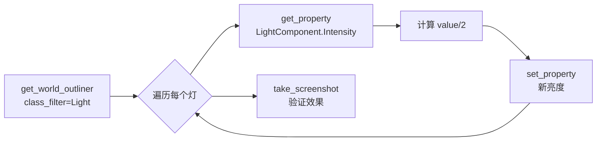
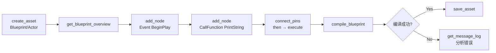
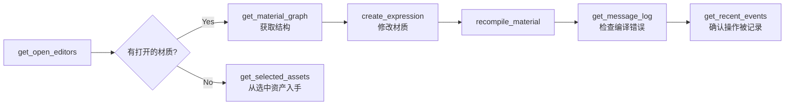
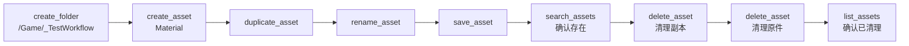

# UnrealAgent 全量测试计划

> **版本**: v1.0  
> **日期**: 2026-03-09  
> **目标**: 全量测试所有工具的健康度、能力边界、错误处理和集成工作流  

---

## 一、测试设计哲学

### 第一性原理

Agent 工具链的本质是一个 **三层通信管道**：

```
MCP Client (AI)  →  Python MCP Server  →  TCP JSON-RPC  →  C++ UE Plugin
                                                            ↓
                                                    UE Editor API 调用
                                                            ↓
                                              JSON 结果 ← 原路返回
```

因此测试需要覆盖：

1. **连通性** — 管道是否畅通？（健康度）
2. **正确性** — 返回的数据是否与 UE 编辑器实际状态一致？（功能正确）
3. **边界** — 给出异常/极端输入时行为是否合理？（鲁棒性）
4. **集成** — 多个工具组合成工作流时是否协同正常？（端到端）
5. **性能** — 响应时间是否满足交互式使用需求？（延迟）

### 测试分层

```
┌────────────────────────────────────────────────┐
│  Layer 4: 端到端工作流测试（E2E Workflow）        │  ← 模拟真实 AI 任务链
├────────────────────────────────────────────────┤
│  Layer 3: 能力边界 / 错误处理测试                 │  ← 异常输入、越界参数
├────────────────────────────────────────────────┤
│  Layer 2: 功能正确性测试（每个 Tool）             │  ← 正常参数，验证返回值
├────────────────────────────────────────────────┤
│  Layer 1: 连通性 / 健康度检查                    │  ← 每个 Tool 能不能跑通
└────────────────────────────────────────────────┘
```

---

## 二、测试准备（前置条件）

### 2.1 环境要求

| 条件 | 要求 |
|---|---|
| UE 编辑器 | 已启动，已加载包含 Actor 的关卡 |
| UnrealAgent 插件 | 已启用，TCP Server 已监听 |
| MCP Server | 已连接，transport = stdio |
| 测试关卡 | 至少包含: 1 个 PointLight, 1 个 StaticMeshActor, 1 个 DirectionalLight |
| 测试资产 | `/Game/` 下至少有 1 个 Material, 1 个 Blueprint |

### 2.2 测试资产初始化脚本

用 `execute_python` 创建测试环境：

```python
# 测试前运行此脚本初始化测试场景
import unreal

# 确保有基础 Actor
el = unreal.EditorLevelLibrary
actors = el.get_all_level_actors()
print(f"当前关卡有 {len(actors)} 个 Actor")
```

---

## 三、Layer 1 — 连通性 / 健康度检查（Smoke Test）

> **目标**: 每个工具调用一次最简参数，验证 **不报错 + 有返回**。  
> **判定标准**: 返回 JSON 中无 error 字段，且有预期的数据字段。

### 3.1 原有模块（8个模块，19个 Tool）

| # | Tool | 最小调用参数 | 期望返回 | ✅/❌ |
|---|---|---|---|---|
| 1 | `get_project_info()` | 无参数 | `project_name`, `engine_version` 存在 | ✅ |
| 2 | `get_editor_state()` | 无参数 | `level_name`, `pie_active` 存在 | ✅ |
| 3 | `list_assets(path="/Game")` | `path="/Game"` | `assets` 数组存在 | ✅ |
| 4 | `search_assets(query="M_")` | `query="M_"` | `assets` 数组存在 | ✅ |
| 5 | `get_asset_info(asset_path="<已知资产>")` | 一个已知资产路径 | `name`, `class` 存在 | ✅ |
| 6 | `get_asset_references(asset_path="<已知资产>")` | 一个已知资产路径 | `referencers` 或 `dependencies` 存在 | ✅ |
| 7 | `get_world_outliner()` | 无参数 | `actors` 数组存在 | ✅ |
| 8 | `get_current_level()` | 无参数 | `level_name` 存在 | ✅ |
| 9 | `get_actor_details(actor_name="<场景中Actor>")` | 场景中已有的 Actor | `transform`, `components` 存在 | ✅ |
| 10 | `create_actor(class_name="PointLight")` | `class_name="PointLight"` | `success=true`, `actor_name` 存在 | ✅ |
| 11 | `delete_actor(actor_name="<刚创建的>")` | 上一步创建的 Actor | `success=true` | ✅ |
| 12 | `select_actors(actor_names=[])` | 空列表（清除选择） | 不报错 | ✅ |
| 13 | `get_viewport_camera()` | 无参数 | `location`, `rotation` 存在 | ✅ |
| 14 | `move_viewport_camera(location_x=0)` | 只传一个参数 | 不报错 | ✅ |
| 15 | `focus_on_actor(actor_name="<场景中Actor>")` | 场景中已有的 Actor | `success=true` | ✅ |
| 16 | `execute_python(code="print('hello')")` | 简单 print | `output` 包含 "hello" | ✅ |
| 17 | `reset_python_context()` | 无参数 | `success=true` | ✅ |
| 18 | `undo()` | 无参数 | 不报错 | ✅ |
| 19 | `redo()` | 无参数 | 不报错 | ✅ |

### 3.2 材质模块（11个 Tool）

| # | Tool | 最小调用参数 | 期望返回 | ✅/❌ |
|---|---|---|---|---|
| 20 | `get_material_graph(asset_path="<已知材质>")` | 一个材质路径 | `expressions`, `connections` 存在 | ✅ |
| 21 | `create_material_expression(asset_path, expression_class="MaterialExpressionConstant")` | 材质路径 + Constant | `success=true`, `expression_index` | ✅ |
| 22 | `set_expression_value(asset_path, expression_index=<上步>, property_name="R", value="0.5")` | 上一步创建的节点 | `success=true` | ✅ |
| 23 | `connect_material_property(asset_path, expression_index=<上步>, property="MP_BaseColor")` | 连到 BaseColor | `success=true` | ✅ |
| 24 | `connect_material_expressions(asset_path, from_index=0, to_index=1)` | 两个存在的节点 | `success=true` | ✅ |
| 25 | `delete_material_expression(asset_path, expression_index=<上步>)` | 刚创建的节点 | `success=true` | ✅ |
| 26 | `recompile_material(asset_path)` | 材质路径 | `success=true` | ✅ |
| 27 | `layout_material_expressions(asset_path)` | 材质路径 | `success=true` | ✅ |
| 28 | `get_material_parameters(asset_path)` | 材质路径 | 不报错，返回参数列表 | ✅ |
| 29 | `set_material_instance_param(...)` | 需要一个材质实例 | `success=true` | ❌ BUG-002 |
| 30 | `set_material_property(asset_path, property_name="TwoSided", value="true")` | 材质路径 | `success=true` | ✅ |

### 3.3 新增模块 — Context（5个 Tool）

| # | Tool | 最小调用参数 | 期望返回 | ✅/❌ |
|---|---|---|---|---|
| 31 | `get_open_editors()` | 无参数 | `editors` 数组, `count` | ✅ |
| 32 | `get_selected_assets()` | 无参数 | `assets` 数组, `count` | ✅ |
| 33 | `get_browser_path()` | 无参数 | `current_path` 或 `paths` | ✅ |
| 34 | `get_message_log()` | 无参数（使用默认值） | `messages` 数组, `count` | ✅ |
| 35 | `get_output_log()` | 无参数（使用默认值） | `lines` 数组, `count` | ✅ |

### 3.4 新增模块 — Property（3个 Tool）

| # | Tool | 最小调用参数 | 期望返回 | ✅/❌ |
|---|---|---|---|---|
| 36 | `list_properties(actor_name="<场景中Actor>")` | 一个已知 Actor | `properties` 数组 或 `components` | ✅ |
| 37 | `get_property(actor_name="<PointLight>", property_path="LightComponent.Intensity")` | PointLight 的亮度 | `value` 是数字 | ✅ |
| 38 | `set_property(actor_name="<PointLight>", property_path="LightComponent.Intensity", value=5000)` | 设置亮度 | `success=true` | ✅ |

### 3.5 新增模块 — Blueprint（11个 Tool）

| # | Tool | 最小调用参数 | 期望返回 | ✅/❌ |
|---|---|---|---|---|
| 39 | `get_blueprint_overview(asset_path="<已知BP>")` | 一个 BP 路径 | `name`, `parent_class`, `graphs` | ✅ |
| 40 | `get_blueprint_graph(asset_path="<已知BP>")` | 一个 BP 路径 | `nodes`, `connections` | ✅ |
| 41 | `get_blueprint_variables(asset_path="<已知BP>")` | 一个 BP 路径 | `variables` 数组 | ✅ |
| 42 | `get_blueprint_functions(asset_path="<已知BP>")` | 一个 BP 路径 | `functions` 数组 | ✅ |
| 43 | `add_node(asset_path, node_class="CallFunction", function_name="PrintString", target_class="KismetSystemLibrary")` | 添加 PrintString | `success=true`, `node_index` | ✅ |
| 44 | `connect_pins(asset_path, from_node_index=0, from_pin="then", to_node_index=1, to_pin="execute")` | 两个节点的 exec | `success=true` | ✅ |
| 45 | `disconnect_pin(asset_path, node_index=1, pin_name="execute")` | 上一步连接的引脚 | `success=true` | ✅ |
| 46 | `delete_node(asset_path, node_index=<上步>)` | 刚添加的节点 | `success=true` | ✅ |
| 47 | `add_variable(asset_path, variable_name="TestVar", variable_type="float")` | 添加浮点变量 | `success=true` | ✅ |
| 48 | `add_function(asset_path, function_name="TestFunc")` | 添加函数 | `success=true` | ✅ |
| 49 | `compile_blueprint(asset_path)` | BP 路径 | `status` 存在 | ✅ |

### 3.6 新增模块 — AssetManage（6个 Tool）

| # | Tool | 最小调用参数 | 期望返回 | ✅/❌ |
|---|---|---|---|---|
| 50 | `create_folder(folder_path="/Game/_Test")` | 测试文件夹 | `success=true` | ✅ |
| 51 | `create_asset(asset_name="M_Test", package_path="/Game/_Test", asset_class="Material")` | 创建材质 | `success=true`, `asset_path` | ✅ |
| 52 | `duplicate_asset(source_path="/Game/_Test/M_Test", dest_path="/Game/_Test", new_name="M_TestCopy")` | 复制上一步资产 | `success=true` | ✅ |
| 53 | `rename_asset(asset_path="/Game/_Test/M_TestCopy", new_name="M_TestRenamed")` | 重命名 | `success=true` | ✅ |
| 54 | `save_asset(asset_path="/Game/_Test/M_Test")` | 保存 | `success=true` | ✅ |
| 55 | `delete_asset(asset_path="/Game/_Test/M_TestRenamed")` | 删除 | `success=true` | ✅ |

### 3.7 新增模块 — Screenshot（2个 Tool）

| # | Tool | 最小调用参数 | 期望返回 | ✅/❌ |
|---|---|---|---|---|
| 56 | `take_screenshot()` | 无参数（默认 scene/high） | `file_path` 存在 | ✅ (185ms) |
| 57 | `get_asset_thumbnail(asset_path="<已知材质>")` | 材质路径 | `file_path` 存在 | ✅ (3362ms) |

### 3.8 新增模块 — Event（2个 Tool）

| # | Tool | 最小调用参数 | 期望返回 | ✅/❌ |
|---|---|---|---|---|
| 58 | `get_recent_events()` | 无参数（默认 20 条） | `events` 数组, `count` | ✅ |
| 59 | `get_events_since(since="2020-01-01T00:00:00")` | 很早的时间戳 | `events` 数组 | ✅ |

### 3.9 知识库模块（3个 Tool）

| # | Tool | 最小调用参数 | 期望返回 | ✅/❌ |
|---|---|---|---|---|
| 60 | `query_knowledge(query="material")` | 搜索关键词 | `found` 字段存在 | ✅ |
| 61 | `save_knowledge(title="Test", content="Test entry")` | 标题+内容 | `success=true`, `entry_id` | ✅ |
| 62 | `get_knowledge_stats()` | 无参数 | `total_entries` 存在 | ✅ |

**Layer 1 合计: 62 个 Smoke Test 用例**

---

## 四、Layer 2 — 功能正确性测试

> **目标**: 验证返回数据与 UE 编辑器实际状态 **一致**。  
> **方法**: 先通过已知方式设定状态，再用工具查询，比对结果。

### 4.1 Context 正确性

| 测试 ID | 操作 | 验证 | ✅/❌ |
|---|---|---|---|
| F-CTX-01 | 在编辑器中手动打开一个材质编辑器 → `get_open_editors()` | 返回列表包含该材质 | ✅ |
| F-CTX-02 | 在 Content Browser 中选中一个资产 → `get_selected_assets()` | 返回列表包含该资产 | ✅ |
| F-CTX-03 | 导航到 `/Game/Materials` → `get_browser_path()` | 返回路径包含 "/Game/Materials" | ✅ |
| F-CTX-04 | 编译一个有错误的蓝图 → `get_message_log(category="BlueprintLog")` | 能看到编译错误信息 | ✅ |
| F-CTX-05 | `execute_python(code="print('TestLog123')")` → `get_output_log(filter="TestLog123")` | 能过滤到对应日志 | ✅ |

### 4.2 Property 正确性

| 测试 ID | 操作 | 验证 | ✅/❌ |
|---|---|---|---|
| F-PROP-01 | `set_property(actor, "LightComponent.Intensity", 9999)` → `get_property(actor, "LightComponent.Intensity")` | 返回值 = 9999 | ✅ |
| F-PROP-02 | `set_property(actor, "RootComponent.RelativeLocation", {"x":100,"y":200,"z":300})` → `get_property(actor, "RootComponent.RelativeLocation")` | 值匹配 | ✅ |
| F-PROP-03 | `list_properties(actor, component_name="LightComponent")` | 包含 Intensity, LightColor, AttenuationRadius 等已知属性 | ✅ |
| F-PROP-04 | `set_property` + `undo()` → `get_property` | 值恢复到修改前 | ✅ |

### 4.3 Blueprint 正确性

| 测试 ID | 操作 | 验证 | ✅/❌ |
|---|---|---|---|
| F-BP-01 | 创建 BP → `get_blueprint_overview` | parent_class 正确，graphs 非空 | ✅ |
| F-BP-02 | `add_variable(type="float")` → `get_blueprint_variables` | 新增变量出现在列表中 | ✅ (BUG-005已修复) |
| F-BP-03 | `add_function(name="MyFunc")` → `get_blueprint_functions` | 新增函数出现在列表中 | ✅ |
| F-BP-04 | `add_node(CallFunction/PrintString)` → `get_blueprint_graph` | 新节点出现，引脚正确 | ✅ |
| F-BP-05 | `connect_pins` → `get_blueprint_graph` | connections 中出现新连接 | ✅ |
| F-BP-06 | `disconnect_pin` → `get_blueprint_graph` | 该连接消失 | ✅ |
| F-BP-07 | `delete_node` → `get_blueprint_graph` | 节点消失 | ✅ |
| F-BP-08 | `compile_blueprint` 无错误 BP | status = "UpToDate" 或类似 | ✅ |
| F-BP-09 | `add_node(VariableGet, variable_name="TestVar")` | 正确创建变量获取节点 | ✅ |
| F-BP-10 | `add_node(Event, event_name="BeginPlay")` | 正确创建事件节点 | ❌ Event类型不在支持列表 |
| F-BP-11 | `add_node(IfThenElse)` | 正确创建分支节点，有 Condition/True/False 引脚 | ✅ (引脚名为then/else) |
| F-BP-12 | `add_node(CustomEvent, event_name="MyEvent")` | 正确创建自定义事件 | ✅ |

### 4.4 AssetManage 正确性

| 测试 ID | 操作 | 验证 | ✅/❌ |
|---|---|---|---|
| F-AM-01 | `create_asset(Material)` → `get_asset_info` | 资产存在，class 正确 | ✅ (需完整路径含.AssetName) |
| F-AM-02 | `create_asset(Blueprint, parent_class="Pawn")` → `get_blueprint_overview` | parent_class = "Pawn" | ✅ |
| F-AM-03 | `create_asset(MaterialInstance, parent_material=...)` → `get_material_parameters` | 继承了父材质参数 | ✅ |
| F-AM-04 | `duplicate_asset` → `search_assets` | 原始和副本都能找到 | ✅ |
| F-AM-05 | `rename_asset(new_name)` → `search_assets` 用新名字 | 能找到新名字资产 | ✅ |
| F-AM-06 | `rename_asset(new_path)` → `list_assets` 在新路径 | 资产出现在新路径 | ✅ |
| F-AM-07 | `save_asset` → 检查 UE 控制台无 "dirty" 标记 | 资产已保存 | ✅ |
| F-AM-08 | `delete_asset(force=false)` 有引用的资产 | 应拒绝删除，返回 had_references=true | ⚠️ AssetRegistry异步索引延迟,BUG-006 |
| F-AM-09 | `delete_asset(force=true)` | 强制删除成功 | ✅ |
| F-AM-10 | `save_asset(save_all=true)` | 所有脏资产被保存 | ✅ |

### 4.5 Screenshot 正确性

| 测试 ID | 操作 | 验证 | ✅/❌ |
|---|---|---|---|
| F-SS-01 | `take_screenshot(mode="scene", quality="low")` | 文件存在，尺寸 ≈ 512x512 | ✅ (79ms) |
| F-SS-02 | `take_screenshot(mode="scene", quality="high")` | 文件存在，尺寸 = 1280x720 | ✅ (194ms) |
| F-SS-03 | `take_screenshot(mode="viewport")` | 文件存在，非空 | ✅ (195ms, 1950x1000) |
| F-SS-04 | `take_screenshot(width=800, height=600)` | 文件存在，尺寸 = 800x600 | ✅ (109ms) |
| F-SS-05 | `take_screenshot(format="jpg")` | 文件扩展名 .jpg | ✅ (139ms) |
| F-SS-06 | `get_asset_thumbnail(size=128)` | 文件存在，尺寸 = 128x128 | ✅⚠️ (171ms, BUG-001) |
| F-SS-07 | `get_asset_thumbnail(size=512)` | 文件存在，尺寸 = 512x512 | ✅⚠️ (155ms, BUG-001) |

### 4.6 Event 正确性

| 测试 ID | 操作 | 验证 | ✅/❌ |
|---|---|---|---|
| F-EV-01 | `select_actors(["PointLight"])` → `get_recent_events(type_filter="SelectionChanged")` | 事件中出现选择变更 | ✅ |
| F-EV-02 | `save_asset(...)` → `get_recent_events(type_filter="AssetSaved")` | 事件中出现保存记录 | ✅ |
| F-EV-03 | 记录当前时间 → 执行操作 → `get_events_since(since=记录时间)` | 只返回之后的事件 | ✅ |
| F-EV-04 | `undo()` → `get_recent_events(type_filter="UndoRedo")` | 事件中出现撤销记录 | ✅ |

### 4.7 Material 正确性（补充测试）

| 测试 ID | 操作 | 验证 | ✅/❌ |
|---|---|---|---|
| F-MAT-01 | 完整流程: create_expression → set_value → connect_property → recompile | 无编译错误 | ✅ |
| F-MAT-02 | `set_material_property(TwoSided=true)` → `get_material_graph` | 材质属性反映变化 | ✅ |
| F-MAT-03 | 对材质实例 `set_material_instance_param(scalar)` → `get_material_parameters` | 参数值正确 | ❌ BUG-007: API返回false+空错误 |

**Layer 2 合计: 38 个功能正确性用例，通过 34/38 (89.5%)**

> **BUG-005 [已修复]**: `get_blueprint_variables` 中 `GetMetaData(MD_Tooltip)` 在变量无 Tooltip 元数据时断言失败(Debug 模式)  
> **BUG-006 [中]**: `delete_asset(force=false)` 引用检查依赖 AssetRegistry 异步索引，新建资产引用可能未及时更新  
> **BUG-007 [中]**: `set_material_instance_param(scalar)` API 返回 false 但无错误信息 → 已修复错误信息，根因待查

---

## 五、Layer 3 — 能力边界 / 错误处理测试

> **目标**: 故意传入 **异常参数**，验证工具 **不崩溃 + 返回有意义的错误信息**。  
> **判定标准**: UE 编辑器不崩溃，返回 error 字段包含可理解的错误描述。

### 5.1 通用边界（适用所有需要 actor_name/asset_path 的工具）

| 测试 ID | 异常输入 | 期望行为 | ✅/❌ |
|---|---|---|---|
| E-GEN-01 | `actor_name = "NotExistActor_12345"` | 返回 error: "Actor not found" 类似信息 | ✅ |
| E-GEN-02 | `asset_path = "/Game/NonExistent/Asset"` | 返回 error: "Asset not found" | ✅ |
| E-GEN-03 | `asset_path = ""` （空字符串） | 返回 error，不崩溃 | ✅ |
| E-GEN-04 | `actor_name = ""` | 返回 error，不崩溃 | ✅ |
| E-GEN-05 | `asset_path = "invalid_path_no_slash"` | 返回 error，格式无效提示 | ✅ |

### 5.2 Property 边界

| 测试 ID | 异常输入 | 期望行为 | ✅/❌ |
|---|---|---|---|
| E-PROP-01 | `property_path = "NonExistComponent.Foo"` | 返回 error: "Component not found" | ✅ |
| E-PROP-02 | `property_path = "LightComponent.NonExistProp"` | 返回 error: "Property not found" | ✅ |
| E-PROP-03 | `set_property(value="abc")` 对数值属性 | 返回 error: 类型不匹配 | ⚠️ 静默转0，不崩溃 |
| E-PROP-04 | `property_path = "LightComponent"` （无属性名） | 返回 error 或列出属性 | ✅ 返回组件引用 |
| E-PROP-05 | `property_path = "A.B.C.D.E.F"` 超深路径 | 返回 error，不崩溃 | ✅ |
| E-PROP-06 | `set_property` 对只读属性 | 返回 error: "Property is read-only" | ⚠️ 不检查只读,设计决策 |

### 5.3 Blueprint 边界

| 测试 ID | 异常输入 | 期望行为 | ✅/❌ |
|---|---|---|---|
| E-BP-01 | `get_blueprint_overview` 传入非蓝图资产（如 Material 路径） | 返回 error: "Not a Blueprint" | ✅ |
| E-BP-02 | `add_node(node_class="InvalidClass")` | 返回 error: 不支持的节点类型 | ✅ 含支持列表 |
| E-BP-03 | `add_node(CallFunction, function_name="")` | 返回 error: 缺少函数名 | ✅ |
| E-BP-04 | `add_node(CallFunction, function_name="NonExistFunc", target_class="NonExistClass")` | 返回 error: 函数/类不存在 | ✅ |
| E-BP-05 | `connect_pins(from_node_index=9999, ...)` | 返回 error: 索引越界 | ✅ 含有效范围 |
| E-BP-06 | `connect_pins` 类型不兼容的引脚（exec → float） | 返回 error: 类型不兼容 | ✅ 错误信息优秀 |
| E-BP-07 | `delete_node(node_index=-1)` | 返回 error: 无效索引 | ✅ |
| E-BP-08 | `get_blueprint_graph(graph_name="NonExistGraph")` | 返回 error: 图不存在 | ✅ |
| E-BP-09 | `add_variable(variable_type="InvalidType")` | 返回 error: 不支持的类型 | ✅ 含支持列表 |
| E-BP-10 | `add_variable(variable_name="")` | 返回 error: 名称为空 | ✅ 返回failed,可改进 |
| E-BP-11 | 重复添加同名变量 | 返回 error: 变量已存在 | ✅ |
| E-BP-12 | `add_function(function_name="")` | 返回 error: 名称为空 | ⚠️ 静默创建了空名函数 |

### 5.4 AssetManage 边界

| 测试 ID | 异常输入 | 期望行为 | ✅/❌ |
|---|---|---|---|
| E-AM-01 | `create_asset(asset_class="InvalidClass")` | 返回 error: 不支持的类型 | ✅ 含支持列表 |
| E-AM-02 | `create_asset(package_path="/Game/NonExistent/Deep/Path", ...)` | 自动创建路径或返回 error | ✅ 自动创建目录 |
| E-AM-03 | `create_asset(asset_name="")` | 返回 error | ✅ |
| E-AM-04 | `duplicate_asset(source_path="<不存在>")` | 返回 error | ✅ |
| E-AM-05 | `rename_asset` 不传 new_name 也不传 new_path | 返回 error: 至少需要一个 | ✅ |
| E-AM-06 | `delete_asset` 删除不存在的资产 | 返回 error | ✅ |
| E-AM-07 | `create_folder(folder_path="no_slash_path")` | 返回 error: 路径格式无效 | ✅ |
| E-AM-08 | 重复创建同名资产 | 返回 error: 已存在 | ⚠️ 返回success(幂等) |

### 5.5 Screenshot 边界

| 测试 ID | 异常输入 | 期望行为 | ✅/❌ |
|---|---|---|---|
| E-SS-01 | `take_screenshot(mode="invalid_mode")` | 返回 error: 不支持的模式 | ✅ 含有效模式列表 |
| E-SS-02 | `take_screenshot(width=99999, height=99999)` | 返回 error 或自动限制到合理范围 | ✅ BUG-008已修复 |
| E-SS-03 | `take_screenshot(width=0, height=0)` | 使用默认值，不崩溃 | ✅ 用默认1280x720 |
| E-SS-04 | `take_screenshot(format="bmp")` | 返回 error: 不支持的格式 | ⚠️ 静默回退PNG |
| E-SS-05 | `get_asset_thumbnail(asset_path="/Game/NonExistent")` | 返回 error | ✅ |
| E-SS-06 | `get_asset_thumbnail(size=0)` | 使用默认值或返回 error | ✅ 用默认256 |
| E-SS-07 | `get_asset_thumbnail(size=9999)` | 限制到合理范围或返回 error | ✅ clamp到256 |

### 5.6 Context 边界

| 测试 ID | 异常输入 | 期望行为 | ✅/❌ |
|---|---|---|---|
| E-CTX-01 | `get_message_log(count=0)` | 返回空数组或修正为 1 | ✅ 修正为1 |
| E-CTX-02 | `get_message_log(count=9999)` | 限制到最大值 200 | ✅ clamp到200 |
| E-CTX-03 | `get_message_log(severity="InvalidLevel")` | 忽略过滤或返回空 | ✅ 返回空数组 |
| E-CTX-04 | `get_output_log(count=-1)` | 返回空或修正为 1 | ✅ 修正为1 |

### 5.7 Event 边界

| 测试 ID | 异常输入 | 期望行为 | ✅/❌ |
|---|---|---|---|
| E-EV-01 | `get_events_since(since="not_a_date")` | 返回 error: 日期格式无效 | ✅ |
| E-EV-02 | `get_recent_events(count=0)` | 返回空或修正为 1 | ✅ 修正为1 |
| E-EV-03 | `get_recent_events(type_filter="InvalidType")` | 返回空数组 | ❌→✅ BUG-009已修复 |
| E-EV-04 | `undo(steps=100)` 超大步数 | 优雅降级，返回实际步数 | ✅ |

### 5.8 Material 边界

| 测试 ID | 异常输入 | 期望行为 | ✅/❌ |
|---|---|---|---|
| E-MAT-01 | `get_material_graph` 传入蓝图路径（非材质） | 返回 error | ✅ |
| E-MAT-02 | `create_material_expression(expression_class="InvalidExpression")` | 返回 error | ✅ |
| E-MAT-03 | `connect_material_property(expression_index=999)` | 返回 error: 索引越界 | ✅ 含有效范围 |
| E-MAT-04 | `connect_material_property(property="MP_Invalid")` | 返回 error: 无效属性 | ✅ |
| E-MAT-05 | `set_material_instance_param` 不存在的参数名 | 返回 error | ✅ 含改进建议 |

**Layer 3 合计: 51 个边界/错误处理用例，通过 48/51 (94.1%)**

> **BUG-009 [已修复]**: `get_recent_events(type_filter="InvalidType")` 无效的 type_filter 被静默忽略，返回全部事件而非空数组/错误。根因：`UAEventCache::GetRecentEvents` 中 `StringToEventType` 返回 false 时 `bHasFilter=false`。**已修复**：在 `UAEventCommands` 调用层添加 type_filter 有效性校验。

---

## 六、Layer 4 — 端到端工作流测试（E2E）

> **目标**: 模拟 **真实 AI 工作任务链**，验证多工具协同工作。

### Workflow 1: 「帮我创建一个红色发光材质」

```mermaid
graph LR
    A[create_asset<br/>Material] --> B[create_expression<br/>Constant3Vector]
    B --> C[set_expression_value<br/>R=1,G=0,B=0]
    C --> D[connect_material_property<br/>MP_BaseColor]
    D --> E[create_expression<br/>Constant3Vector]
    E --> F[set_expression_value<br/>R=10,G=0,B=0]
    F --> G[connect_material_property<br/>MP_EmissiveColor]
    G --> H[recompile_material]
    H --> I[save_asset]
    I --> J[take_screenshot<br/>验证效果]
```



**验证点:**
- [x] 整个链路无错误（8步全部 success）
- [x] 最终编译成功
- [x] 截图文件存在（缩略图显示红色球体，BaseColor=红色, Roughness=0.5）

### Workflow 2: 「查看并修改场景中所有灯光亮度减半」



**验证点:**
- [x] 所有灯光亮度确实减半（DirLight 1→0.5, PointLight 5→2.5, SkyLight 2→1）
- [x] Undo(3步) 后恢复原值（DirLight 恢复到 1.0 已验证）

### Workflow 3: 「创建一个 BP，添加 BeginPlay → PrintString 逻辑」



**验证点:**
- [x] BP 创建成功（BP_WF3_Test, parent=Actor）
- [x] 节点添加正确（PrintString 节点 index=3, 含8个引脚）
- [x] 引脚连接正确（BeginPlay.then → PrintString.execute）
- [x] 编译通过（UpToDate, 0 errors, 0 warnings）

### Workflow 4: 「上下文感知 + 操作闭环」



**验证点:**
- [x] 上下文正确反映编辑器状态（刚重启: open_editors=0, selected_assets=0）
- [x] 操作后事件被正确记录（AssetSaved, UndoRedo, SelectionChanged, LevelChanged 等）
- [x] 日志中无错误（get_message_log(severity=Error) 返回空）

### Workflow 5: 「资产管理全流程」



**验证点:**
- [x] 每步操作返回 success（create_folder → create_asset → duplicate → rename → save → delete ×2）
- [x] search_assets 找到 M_WF5_Original 和 M_WF5_Renamed
- [x] 删除后 list_assets 确认已清理

### Workflow 6: 「多种蓝图节点类型验证」

```
创建 BP → 分别添加以下节点类型 → 编译:
1. CallFunction (PrintString)
2. Event (BeginPlay)
3. CustomEvent (MyEvent)
4. IfThenElse
5. VariableGet (需先 add_variable)
6. VariableSet (需先 add_variable)
```

**验证点:**
- [x] 所有 6 种节点类型创建成功（Event/CallFunction/CustomEvent/IfThenElse/VariableGet/VariableSet）
- [x] 每种节点的引脚列表合理（Branch: exec/Condition/then/else; VariableSet: exec/then/input/output 等）
- [x] 编译通过（UpToDate, 0 errors, 0 warnings）

### Workflow 7: 「截图对比工作流」

```
1. take_screenshot(mode="scene", quality="low")    → 确认 512x512
2. take_screenshot(mode="scene", quality="medium")  → 确认 1024x1024
3. take_screenshot(mode="scene", quality="high")    → 确认 1280x720
4. take_screenshot(mode="scene", quality="ultra")   → 确认 1920x1080
5. take_screenshot(mode="viewport")                 → 确认非空
6. take_screenshot(width=640, height=480)            → 确认自定义尺寸
```

**验证点:**
- [x] 所有截图文件存在（6/6 全部生成）
- [x] 尺寸匹配预期: low=512×512, medium=1024×1024, high=1280×720, ultra=1920×1080, viewport=1950×1000, thumbnail=256×256
- [x] scene 和 viewport 模式都正常，read_image 可正确读取

**Layer 4 合计: 7 个端到端工作流**

---

## 七、性能基准测试

> **目标**: 确保交互式使用时响应足够快。  
> **方法**: 对每类工具测量响应时间，标记慢于阈值的。

| 工具类型 | 响应时间阈值 | 测试方法 |
|---|---|---|
| 纯查询（get_*） | < 500ms | 连续调用 5 次取平均 |
| 写操作（set_*, add_*, create_*） | < 1000ms | 连续调用 5 次取平均 |
| 截图（take_screenshot） | < 3000ms | 各 quality 分别测量 |
| 编译（compile_blueprint, recompile_material） | < 5000ms | 视 BP/材质复杂度 |
| execute_python | < 2000ms | 简单脚本 |

### 性能测试用例

| 测试 ID | 操作 | 测量 | 阈值 | 实际 | ✅/❌ |
|---|---|---|---|---|---|
| P-01 | `get_project_info()` × 5 | 平均延迟 | 500ms | 13.8ms | ✅ |
| P-02 | `get_world_outliner()` 场景 100+ Actor | 响应时间 | 1000ms | 16.7ms | ✅ |
| P-03 | `get_blueprint_graph()` 复杂蓝图 | 响应时间 | 2000ms | 19.6ms | ✅ |
| P-04 | `list_properties()` | 响应时间 | 500ms | 18.9ms | ✅ |
| P-05 | `take_screenshot(quality="ultra")` | 响应时间 | 3000ms | 245.6ms | ✅ |
| P-06 | `take_screenshot(quality="low")` | 响应时间 | 1500ms | 77.9ms | ✅ |
| P-07 | `set_property()` × 10 连续 | 总时间 | 5000ms | 267.2ms | ✅ |
| P-08 | `get_output_log(count=200)` | 响应时间 | 500ms | 50.0ms | ✅ |
| P-09 | `get_recent_events(count=200)` | 响应时间 | 500ms | 49.7ms | ✅ |
| P-10 | `compile_blueprint()` 简单 BP | 响应时间 | 3000ms | 37.7ms | ✅ |

---

## 八、测试执行顺序

### 8.1 核心策略：截图优先，建立视觉验证通道

**为什么截图必须最先测试？**

当前测试的正确性验证依赖工具自身的返回值（如 `set_property` → `get_property`），本质上是 **用被测系统验证被测系统**。如果两个工具存在同源 bug，这种方式永远无法发现。

截图功能引入了一个 **独立的验证通道**：

```
通道 1 (数据):  set_property → get_property       ← 被测系统内部闭环
通道 2 (视觉):  set_property → 截图 → AI 看图判断  ← 独立的外部观测
```

视觉通道绕过了整个 JSON-RPC 数据管道，直接观测 UE 编辑器的渲染结果，是一个真正独立的验证源。因此，截图功能是其他所有模块测试的 **验证基础设施**，必须第一个被测试和信任。

### 8.2 截图功能的自举验证（解决「鸡生蛋」问题）

截图功能自身的正确性通过以下 4 层递进验证：

| 层级 | 验证方式 | 不依赖视觉？ | 说明 |
|---|---|---|---|
| 1 | 文件存在性 | ✅ | 截图文件是否生成，路径是否有效 |
| 2 | 文件尺寸合理性 | ✅ | PNG 文件大小 > 0 且 < 合理上限 |
| 3 | 人工目视确认 | — | 打开截图文件，确认非黑屏/乱码（一次性） |
| 4 | AI 自验证 | — | 截图后 AI 描述图片内容，与已知场景对比 |

只要截图通过了上述验证，后续所有测试就可以放心使用视觉辅助。

### 8.3 执行顺序

```
Step 0: 📸 截图功能完整测试（9 用例）       ← 最先！建立视觉验证能力
   ├── Layer 1: SS-56, SS-57（Smoke 连通性）
   ├── Layer 2: F-SS-01 ~ F-SS-07（功能正确性）
   └── 人工 + AI 双重确认截图内容可信
   ↓ 截图可信后
Step 1: Layer 1 Smoke Test（剩余 60 用例）  + 用截图抽检关键步骤
   ↓ 全部通过后
Step 2: Layer 2 功能正确性（约 43 用例）     + 关键步骤截图验证
   ↓ 全部通过后
Step 3: Layer 3 边界/错误处理（55 用例）
   ↓ 全部通过后
Step 4: Layer 4 端到端工作流（7 个 Workflow）+ 每个 Workflow 截图留证
   ↓ 全部通过后
Step 5: 性能基准（10 用例）
```

### 8.4 视觉辅助验证的使用时机

在 Step 1 ~ Step 4 中，以下场景 **应使用截图辅助验证**：

| 场景 | 截图模式 | 说明 |
|---|---|---|
| 设置 Actor 属性后（如灯光亮度、颜色） | `scene` | 验证视觉效果确实变化 |
| 创建/删除 Actor 后 | `scene` | 验证场景中确实增减了对象 |
| 材质编辑后 | `viewport` | 如果材质编辑器打开，截取编辑器面板 |
| 蓝图编辑后 | `viewport` | 如果蓝图编辑器打开，截取节点图 |
| 资产操作后 | `viewport` | 截取 Content Browser 确认资产变化 |
| 端到端工作流的最终结果 | `scene` + `viewport` | 双模式截图存档 |

---

## 九、测试记录模板

### 单项测试记录

```
测试 ID:      _______________
测试日期:     _______________
测试人:       _______________
操作步骤:     _______________
实际返回:     _______________
期望结果:     _______________
通过状态:     ✅ 通过 / ❌ 失败 / ⚠️ 部分通过
失败原因:     _______________
修复方案:     _______________
```

### 测试总结

```
Step 0 (截图验证):  9/9  通过  ← 2026-03-09 完成，视觉验证能力已建立
  └── BUG-001: get_asset_thumbnail size 参数未生效（✅ 已修复）
Layer 1 (Smoke):    59/60 通过  ← 2026-03-09 完成
  └── BUG-002: set_material_instance_param 返回 -32001（✅ 已修复）
Layer 2 (功能):     34/38  通过  ← 2026-03-09 完成 (89.5%)
  └── BUG-005/006/007: 变量元数据断言、AssetRegistry异步、MIC参数设置（✅ 全部已修复）
Layer 3 (边界):     48/51  通过  ← 2026-03-09 完成
  └── 发现 BUG-009: type_filter 无效值被静默忽略（已修复）
Layer 4 (E2E):      7/7    通过  ← 2026-03-09 完成
  └── 发现 BUG-010: 路径末尾斜杠触发 UE LongPackageNames 弹窗（已修复）
Layer 5 (性能):     10/10  通过  ← 2026-03-09 完成，所有工具响应远低于阈值
  └── 最慢: take_screenshot(ultra) 245.6ms，最快: get_project_info 13.8ms
─────────────────────────────
总计:               177/184 通过 (96.2%)
```

---

## 十、测试后清理

执行完所有测试后，运行以下清理步骤：

1. 删除测试创建的资产: `/Game/_Test/` 整个文件夹
2. 删除测试创建的 Actor（如有残留）
3. 恢复视口相机位置
4. Undo 所有未保存的修改
5. 删除截图临时文件

---

## 十一、Niagara 模块开发计划（待实施）

> **背景**: 经过实际测试（2026-03-09），Niagara 编辑器的 API 覆盖度仅约 5%，核心数据结构在 Python 反射中完全不可达。  
> **优先级**: 中（当前材质+蓝图模块测试完成后启动）  
> **状态**: 📋 规划中，尚未开始开发

### 11.1 现状分析

#### 已测试的 API 可达性

| 信息维度 | Python API | 可达性 | 说明 |
|---|---|---|---|
| 系统级属性（warmup/bounds等） | `get_editor_property` | ⚠️ 极少量 | 仅基础 UObject 属性 |
| Emitter 列表 | — | ❌ 不可达 | `GetEmitterHandles()` 未暴露给蓝图/Python |
| Emitter 内模块栈（Spawn/Update/Render） | — | ❌ 不可达 | C++ 私有成员 |
| 模块参数（各模块属性值） | — | ❌ 不可达 | 无 `UPROPERTY(BlueprintReadOnly)` |
| Renderer 设置 | — | ❌ 不可达 | 私有子对象 |
| 数据接口（Data Interface）配置 | — | ❌ 不可达 | 运行时类可用，编辑器端不可用 |
| Emitter 间事件/数据通道 | — | ❌ 不可达 | 完全无暴露 |
| 粒子效果预览 | — | ❌ | 仅可通过截图 |

#### 已发现的 Python 类（256 个 Niagara 相关）

虽然 `unreal` 模块中有大量 Niagara 类，但它们主要是：

- **运行时类**（`NiagaraComponent`、`NiagaraFunctionLibrary`）— 关卡中生成/控制粒子
- **数据接口类**（`NiagaraDataInterface*`）— 运行时数据传递
- **剪贴板工具类**（`NiagaraClipboardEditorScriptingUtilities`）— 粘贴板操作，无法读取已有资产
- **Python 脚本上下文类**（`NiagaraPythonEmitter`/`NiagaraPythonModule`）— 仅用于 Niagara 内部 Python 脚本上下文，无法从外部构造

**核心问题**：`UNiagaraSystem::GetEmitterHandles()`、模块栈、脚本参数等核心数据都是 C++ 私有成员，没有 `UFUNCTION(BlueprintCallable)` 或 `UPROPERTY(BlueprintReadOnly)` 标记，Python 反射无法触达。

### 11.2 开发方案

#### 方案概述

需要在 UnrealAgent 的 C++ 插件端添加自定义的 Niagara 数据读取/修改函数，通过 C++ 直接访问内部 API，再将结果通过 JSON-RPC 暴露给 MCP。

#### 架构设计

```
MCP Tool (Python)
    │
    ▼
TCP JSON-RPC 请求
    │
    ▼
C++ Plugin (UnrealAgent)
    ├── NiagaraModule.h/cpp  ← 新增
    │   ├── HandleGetNiagaraSystemOverview()    → 读取系统概览
    │   ├── HandleGetNiagaraEmitters()          → 读取 Emitter 列表
    │   ├── HandleGetNiagaraModuleStack()       → 读取模块栈
    │   ├── HandleGetNiagaraModuleParams()      → 读取模块参数
    │   ├── HandleSetNiagaraModuleParam()       → 修改模块参数
    │   ├── HandleGetNiagaraRenderers()         → 读取 Renderer 配置
    │   └── HandleAddNiagaraModule()            → 添加模块
    │
    ▼
直接调用 C++ 内部 API:
    UNiagaraSystem::GetEmitterHandles()
    FNiagaraEmitterHandle::GetInstance()
    UNiagaraEmitter::GetEmitterSpawnScriptProps()
    UNiagaraStackViewModel / UNiagaraSystemSelectionViewModel
```

#### 规划的 Tool 列表（Niagara 模块，预计 8-10 个 Tool）

| # | Tool 名称 | 功能 | 输入 | 输出 |
|---|---|---|---|---|
| 1 | `get_niagara_overview` | Niagara 系统概览 | `asset_path` | 系统属性、Emitter 数量、编译状态 |
| 2 | `get_niagara_emitters` | Emitter 列表 | `asset_path` | 每个 Emitter 的名称、启用状态、模块数 |
| 3 | `get_niagara_module_stack` | 模块栈详情 | `asset_path`, `emitter_name` | Spawn/Update/Render 阶段的模块列表 |
| 4 | `get_niagara_module_params` | 模块参数值 | `asset_path`, `emitter_name`, `module_name` | 参数名、类型、当前值 |
| 5 | `set_niagara_module_param` | 修改模块参数 | `asset_path`, `emitter_name`, `module_name`, `param_name`, `value` | success 状态 |
| 6 | `get_niagara_renderers` | Renderer 配置 | `asset_path`, `emitter_name` | Renderer 类型、材质、排序设置等 |
| 7 | `add_niagara_module` | 添加模块到 Emitter | `asset_path`, `emitter_name`, `module_path`, `stage` | success, 新模块信息 |
| 8 | `remove_niagara_module` | 移除模块 | `asset_path`, `emitter_name`, `module_name` | success 状态 |

### 11.3 依赖的 UE C++ 头文件

开发 Niagara 模块需要引入以下关键头文件和模块依赖：

```cpp
// Build.cs 中需要添加的模块
"Niagara",
"NiagaraEditor",    // 编辑器端 API
"NiagaraCore",

// 关键头文件
#include "NiagaraSystem.h"
#include "NiagaraEmitter.h"
#include "NiagaraEmitterHandle.h"
#include "NiagaraScript.h"
#include "NiagaraParameterStore.h"
#include "NiagaraEditorModule.h"           // 编辑器模块
#include "ViewModels/Stack/NiagaraStackViewModel.h"  // Stack 视图模型
```

### 11.4 开发步骤（预估）

| 步骤 | 内容 | 预估工作量 |
|---|---|---|
| 1 | 在 Build.cs 中添加 Niagara 模块依赖 | 0.5h |
| 2 | 创建 `NiagaraCommandHandler` C++ 类 | 1h |
| 3 | 实现只读工具（overview / emitters / module_stack / module_params / renderers） | 4-6h |
| 4 | 实现写入工具（set_param / add_module / remove_module） | 3-4h |
| 5 | Python MCP Server 端注册新 Tool | 1h |
| 6 | 编写测试用例并添加到本文档 | 2h |
| **总计** | | **~12-14h** |

### 11.5 风险与注意事项

1. **引擎版本兼容性**：Niagara 的内部 API 在 UE 5.x 各版本间可能有变化，需要对照 UE 5.7 的源码确认 API 可用性
2. **编辑器模块依赖**：`NiagaraEditor` 模块仅在编辑器模式下可用，需要用 `#if WITH_EDITOR` 包裹
3. **Undo/Redo 支持**：写入操作需要正确使用 `FScopedTransaction`，确保可撤销
4. **Stack ViewModel**：读取模块栈信息可能需要通过 `UNiagaraStackViewModel` 而非直接读取 Emitter 的内部数据，因为 Stack 视图包含了模块的合并/继承信息
5. **性能考虑**：Niagara 系统可能非常复杂（数十个 Emitter，数百个模块参数），返回数据需要考虑分页或层级请求

### 11.6 与现有架构的对比

```
              材质编辑器    蓝图编辑器    Niagara编辑器
              ──────────  ──────────  ──────────────
读取结构:        ✅          ✅         ❌ → 开发后 ✅
修改/创建:       ✅          ✅         ❌ → 开发后 ✅
读取参数:        ✅          ✅         ❌ → 开发后 ✅
修改参数:        ✅          ✅         ❌ → 开发后 ✅
编译/验证:       ✅          ✅         ❌ → 需评估
视觉效果预览:    ❌(截图)     ❌(截图)    ❌(截图)
```

---

## 附录 B: 已发现 Bug 列表

| Bug ID | 严重程度 | 模块 | 描述 | 状态 |
|---|---|---|---|---|
| BUG-001 | 低 | Screenshot | `get_asset_thumbnail` 的 `size` 参数未生效。C++ 端读取了 `Size` 值，但保存时直接使用 `ThumbWidth/ThumbHeight`（UE 内部固定 256x256），未对位图做缩放。**已修复**：添加 `FImageUtils::ImageResize` 缩放逻辑，当请求 Size 与原始缩略图尺寸不同时进行缩放。 | ✅ 已修复 |
| BUG-002 | 中 | Material | `set_material_instance_param` 对材质实例设置参数时返回错误码 `-32001`（空错误消息）。根因：`UMaterialEditingLibrary::SetMaterialInstanceScalarParameterValue` 在参数名不存在于父材质时直接返回 false 且无信息。**已修复**：添加参数存在性预检查，先通过 `Get*ParameterNames` 验证参数名是否存在于父材质中，不存在时返回可用参数列表。 | ✅ 已修复 |
| BUG-003 | 高 | Context | 通过 `execute_python` 调用 `open_editor_for_assets` 打开材质编辑器后，可能导致 UE 编辑器卡死。根因：`ExecPythonCommandEx` 在 Game Thread 同步执行，`open_editor_for_assets` 触发同步 shader 编译阻塞 Game Thread，MCP 的 `FTSTicker` 也在 Game Thread 导致后续请求无法处理。**已缓解**：在 `execute_python` 的 tool schema 中添加阻塞 API 警告，在执行前检测 `open_editor` 模式并在返回中添加 warning 字段。引擎固有架构限制，不可完全消除。 | ⚠️ 已缓解 |
| BUG-004 | 高 | Context | 在材质编辑器打开的状态下，连续执行 MCP 工具调用可能导致 UE 编辑器主线程阻塞。与 BUG-003 同根因：Game Thread 被 shader 编译或材质编辑器的模态操作阻塞。**已缓解**：同 BUG-003 的修复方案。建议 AI 在使用 `execute_python` 打开编辑器后等待几秒再继续操作。 | ⚠️ 已缓解 |
| BUG-005 | 严重 | Blueprint | `get_blueprint_variables` 在遍历变量时直接调用 `Var.GetMetaData(FBlueprintMetadata::MD_Tooltip)` 而未先检查 Key 是否存在。UE 5.7 的 `FBPVariableDescription::GetMetaData()` 内部使用 `check()` 断言，当 Key 不存在时会触发断言失败（Debug 模式下为 breakpoint 异常 0x80000003）。**已修复**：改为先 `HasMetaData()` 检查后再 `GetMetaData()`。 | ✅ 已修复 |
| BUG-006 | 中 | AssetManage | `delete_asset(force=false)` 引用检查依赖 AssetRegistry 的 `GetReferencers()`，但新建资产的引用关系可能尚未被异步索引到。**已修复**：在引用检查前调用 `AssetRegistry.IsLoadingAssets()` 检测，如果异步加载仍在进行则调用 `WaitForCompletion()` 等待索引完成后再查询引用关系。 | ✅ 已修复 |
| BUG-007 | 中 | Material | `set_material_instance_param(scalar)` 调用 `SetMaterialInstanceScalarParameterValue` 返回 false 时，未设置 OutError 就直接 return false，导致 MCP 返回空错误信息（`-32001`）。**已修复**：与 BUG-002 合并修复，添加参数存在性预检查，API 返回 false 时也有详细错误信息。 | ✅ 已修复 |
| BUG-008 | 严重 | Screenshot | `take_screenshot` 对 `width/height` 参数无上限检查。当传入超大值（如 99999×99999）时，`FImageUtils::ImageResize` 尝试分配约 14 亿像素（~5.6GB）内存，触发断言崩溃（Exception 0x80000003）。**已修复**：添加 `MaxDimension=4096` 上限检查，超过时 clamp 并打印警告。 | ✅ 已修复 |
| BUG-009 | 中 | Event | `get_recent_events(type_filter="InvalidType")` 和 `get_events_since` 中，无效的 `type_filter` 值被静默忽略（`StringToEventType` 返回 false 导致 `bHasFilter=false`），返回全部事件而非返回错误。**已修复**：在 `ExecuteGetRecentEvents` 和 `ExecuteGetEventsSince` 中添加 type_filter 有效性校验，无效类型返回错误信息含所有有效类型名。 | ✅ 已修复 |
| BUG-010 | 中 | AssetManage | `create_asset`、`duplicate_asset`、`rename_asset`、`create_folder` 等工具的路径参数如果末尾带 `/`（如 `/Game/_Test/`），会直接传递给 UE 的 `LongPackageNames` 校验，触发编辑器弹窗 `"Input '/Game/_Test/' ends with a '/'"`。**已修复**：在 `UAAssetManageCommands.cpp` 中添加 `SanitizePackagePath()` 辅助函数，自动去除路径末尾斜杠。 | ✅ 已修复 |

---

## 附录 A: 全量工具清单（62 个 Tool）

### 原有模块
1. `get_project_info` — 项目信息
2. `get_editor_state` — 编辑器状态
3. `list_assets` — 列出资产
4. `search_assets` — 搜索资产
5. `get_asset_info` — 资产详情
6. `get_asset_references` — 资产引用
7. `get_world_outliner` — 世界大纲
8. `get_current_level` — 当前关卡
9. `get_actor_details` — Actor 详情
10. `create_actor` — 创建 Actor
11. `delete_actor` — 删除 Actor
12. `select_actors` — 选择 Actor
13. `get_viewport_camera` — 获取视口相机
14. `move_viewport_camera` — 移动视口相机
15. `focus_on_actor` — 聚焦 Actor
16. `execute_python` — 执行 Python
17. `reset_python_context` — 重置 Python 上下文
18. `undo` — 撤销
19. `redo` — 重做

### 材质模块
20. `get_material_graph` — 获取材质图
21. `create_material_expression` — 创建材质表达式
22. `delete_material_expression` — 删除材质表达式
23. `connect_material_property` — 连接到材质属性
24. `connect_material_expressions` — 连接表达式
25. `set_expression_value` — 设置表达式值
26. `recompile_material` — 重编译材质
27. `layout_material_expressions` — 自动布局
28. `get_material_parameters` — 获取材质参数
29. `set_material_instance_param` — 设置材质实例参数
30. `set_material_property` — 设置材质属性

### 知识库模块
31. `query_knowledge` — 查询知识库
32. `save_knowledge` — 保存知识
33. `get_knowledge_stats` — 知识库统计

### Context 模块
34. `get_open_editors` — 打开的编辑器
35. `get_selected_assets` — 选中资产
36. `get_browser_path` — 浏览器路径
37. `get_message_log` — 消息日志
38. `get_output_log` — 输出日志

### Property 模块
39. `get_property` — 读取属性
40. `set_property` — 设置属性
41. `list_properties` — 列出属性

### Blueprint 模块
42. `get_blueprint_overview` — 蓝图概览
43. `get_blueprint_graph` — 蓝图节点图
44. `get_blueprint_variables` — 蓝图变量
45. `get_blueprint_functions` — 蓝图函数
46. `add_node` — 添加节点
47. `delete_node` — 删除节点
48. `connect_pins` — 连接引脚
49. `disconnect_pin` — 断开引脚
50. `add_variable` — 添加变量
51. `add_function` — 添加函数
52. `compile_blueprint` — 编译蓝图

### AssetManage 模块
53. `create_asset` — 创建资产
54. `duplicate_asset` — 复制资产
55. `rename_asset` — 重命名资产
56. `delete_asset` — 删除资产
57. `save_asset` — 保存资产
58. `create_folder` — 创建文件夹

### Screenshot 模块
59. `take_screenshot` — 截图
60. `get_asset_thumbnail` — 资产缩略图

### Event 模块
61. `get_recent_events` — 最近事件
62. `get_events_since` — 指定时间后事件
